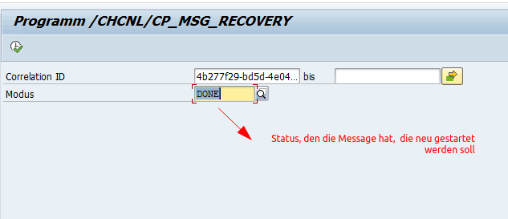

#docmorris

# Transaktionen


/CHCNL/CP_MSGDSPL2 (message Tabelle HSL-ERP Schnittstelle)

/CHCNL/CP_MSGDSPL2 (message Tabelle HSL-ERP Schnittstelle

/CHCNL/FKK_RET_MED (Medpex-Retoure)

/KPSC/CLS_RE (Classifier)

# Messages neu starten

Report /CHCNL/CP_MSG_RECOVERY



Es wird kein neuer Eintrag in der /CHCNL/CP_MSG_LG geschrieben, aber die Schritte werden ausgeführt

# SD: Ursprungsauftrag finden

```
CALL FUNCTION 'RV_ORDER_FLOW_INFORMATION'
        EXPORTING
          comwa         = VALUE vbco6( vbeln = zxblnr_mem )
        TABLES
          vbfa_tab      = lt_vbfa_ret
        EXCEPTIONS
          no_vbfa       = 1
          no_vbuk_found = 2
          OTHERS        = 3.
      IF sy-subrc <> 0.

      ELSE.
        READ TABLE lt_vbfa_ret ASSIGNING FIELD-SYMBOL(<s_vbfa>) WITH KEY vbelv   = space
                                                        vbtyp_n = 'C'
                                                        vbtyp_v = space.
        zopord = <s_vbfa>-vbeln.
```

