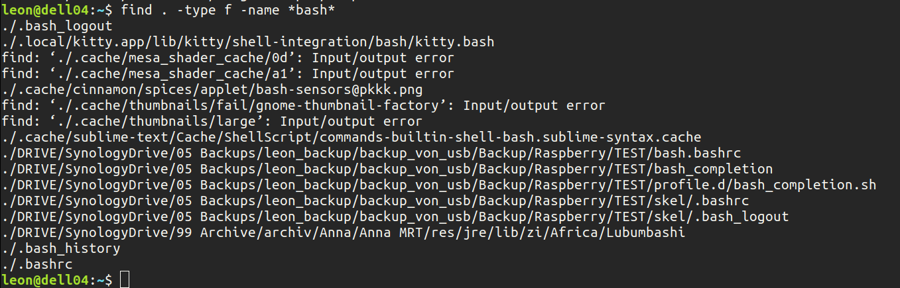
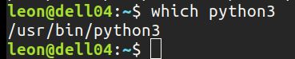
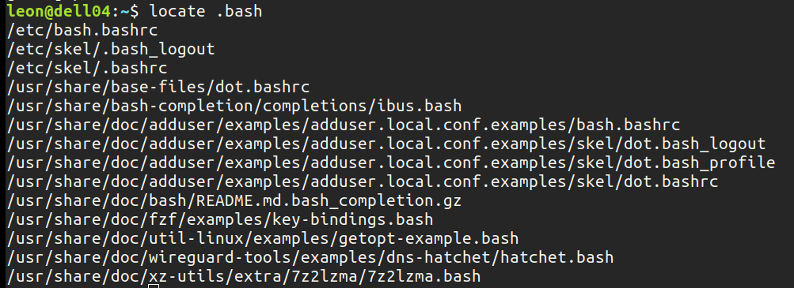

#Linux

# useful Terminal Tools

 - ranger
     - File management
 - trash-cli
     - use trash in terminal (rm removes forever)
 - pfetch
     - like neofetch
 - System monitoring
	 - htop
	 - btop
	 - glances
 - ncdu
     - storage analyzer (nice!)
 - inxi -Fxz
	 - System information
- exa
	- Replacement for ls (edit ~/.bashrc)
	- Has a nice tree view (``` exa --tree ```)
- bat
	- cat clone with syntax highlighting and git integration
- fzf
	- Search Tools

# Guides and Tutorials

- [Creating a Searchable Desktop Icon for Appimage Software on Linux](https://medium.com/@itsmrcrabss/creating-a-searchable-desktop-icon-for-appimage-software-on-linux-82dc9f62ca51)
	- [Archive](https://web.archive.org/web/20231024140700/https://medium.com/@itsmrcrabss/creating-a-searchable-desktop-icon-for-appimage-software-on-linux-82dc9f62ca51)
 - [VIM Tutorial](https://www.freecodecamp.org/news/learn-linux-vim-basic-features-19134461ab85/#:~:text=Yes%2C%20Vim%20provides%20a%20simple,exit%20the%20explorer%20and%20vim.)
 - [Logitech Streamcam config](https://davejansen.com/logitech-streamcam-on-linux/)
    - [Archiv](https://web.archive.org/web/20230519220215/https://davejansen.com/logitech-streamcam-on-linux/)
- [Linux Full Guide - FOSSPOST](https://fosspost.org/linux-full-guide/)
- [Twingate Linux](https://www.twingate.com/docs/linux)
- [Learn Linux TV Tutorials](https://www.youtube.com/playlist?list=PLT98CRl2KxKHdOpQ-uI2QuNcQ0aEAe5bN)
	- Ausführliche Tutorials, verständlich erklärt
	- Hier gibts auch eine Reihe zu Vim

# Desktop Umgebung

- [# From Noob To Power User With Linux Mint Cinnamon](https://www.youtube.com/watch?v=TKX29fJ8U2Y)
	- Hier habe ich rofi kennengelernt. Das ist mal richtig cool. Poweruser Style.

## Fonts Linux

https://averagelinuxuser.com/microsoft-fonts-linux/

sudo apt install ttf-mscorefonts-installer
sudo apt install fonts-crosextra-carlito fonts-crosextra-caladea


# Terminal misc

## Display Hardware Information

[TOP 5 COMMANDS TO DISPLAY HARDWARE INFORMATION ON LINUX](https://freelinuxtutorials.com/top-5-commands-to-display-hardware-information-on-linux/)
Alle Informationen: inxi -Fxz

## Piping in Linux

[geeksforgeeks: Piping in Linux](https://www.geeksforgeeks.org/piping-in-unix-or-linux/)

# Network

## Wireshark

 - Wenn man das System package installiert, fehlen Berechtigungen
 - Folgendes muss ausgeführt werden nach der Installation von Wireshark

```
sudo dpkg-reconfigure wireshark-common
sudo chmod +x /usr/bin/dumpcap	
```
Was ist dumpcap?

# Editing

## Neovim

- [Install Nvim Tree](https://linovox.com/install-and-use-nvim-tree-in-neovim/)
- [Install Which Key](https://linovox.com/install-and-set-up-which-key-in-neovim-nvim/)
- [Install and use Packer](https://linovox.com/install-and-use-packer-in-neovim/)
 - [Vim Cheat Sheet](https://vim.rtorr.com/)
 - [Vim cheatsheet - devhints](https://devhints.io/vim)

# PDF Tools

## Viewer

- [Okular](https://okular.kde.org)
	- Brauchbarerer Viewer mit Annotationen und Markierungsfunktionen
 - Document Viewer (Linux Mint)

## Editors

- PDF24 Tools
- PDF Arranger
- PDF Chain
- PDF Mixtool
- Libreoffice Draw

# Apps

 - [AppImageLauncher](https://github.com/TheAssassin/AppImageLauncher/wiki/Install-on-Ubuntu-or-Debian#use-the-ppas)

# Power Management

- [TLP](https://linrunner.de/tlp/introduction.html)

# Screenshot Tools

 - [Shutter](https://shutter-project.org/)
 - [Flameshot](https://flameshot.org/)

# TAR and GZIP command

[How to Use Tar on Linux | Command Line Tips from Linode's Top Docs](https://www.youtube.com/watch?v=bnQLpaBkBK8)

Combine multiple files into one archive file.

```
tar -cf etc_backup.tar etc
```

 - c -> create
 - f --> provide filename
 - etc_backup.tar --> TAR File to be created
 - etc --> Directory to put in that TAR File

See, whats in a tar file:
```
tar -tf testtar.tar | wc -l
tar -tvf testtar.tar
```

 - t --> list files
 - wc --> word count
 - -l --> count lines for the wc command
 - v --> verbose mode (list the content of a tar as directory listing)

Extract files from tar

```
tar -xf testttar.tar
tar -xvf testttar.tar
```

- x --> extract

Compress files with GZIP

```
gzip testtar.tar
gunzip testtar.tar.gz
```

Combine TAR and GZIP

```
tar -czf Downloads_backup.tar.gz Downloads_Backup
```

- z --> compress tar file using gzip command

Extraction are the same commands using tar command.

# Searching in the Terminal

## find

Looks everywhere.

```
find . -type f -name bash
```



```
find / -user username -perm -4000 -print 2>/dev/null
find / -perm -u=s -type f 2>/dev/null
find / -type f -user root -perm -4000 -exec ls -ldb {} \\; 2>/dev/null
```

## which

Finds locations of commands.

```
which python3
```



## locate

Works with a database (updates every 24 h?)

```
locate .bash
```

