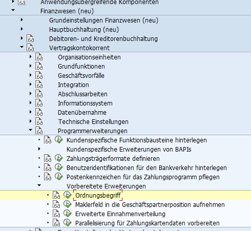
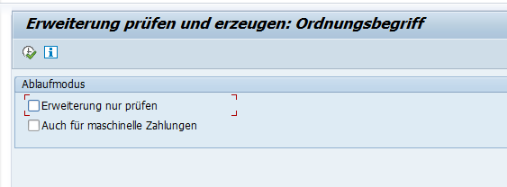
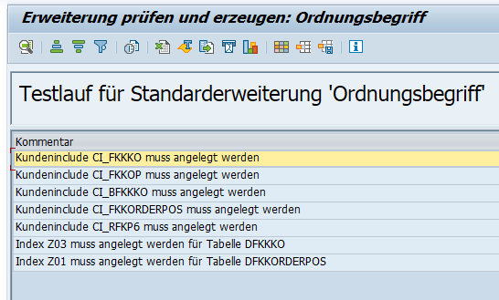
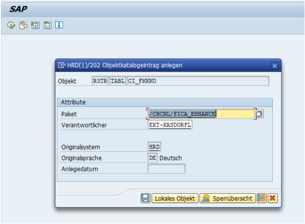
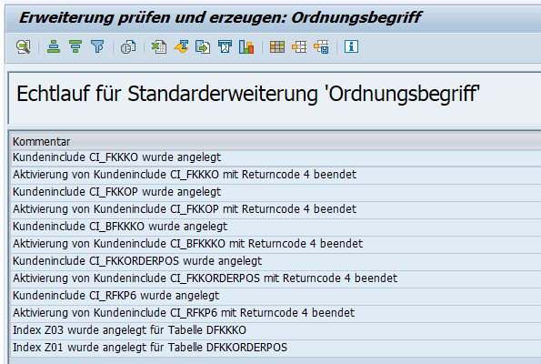
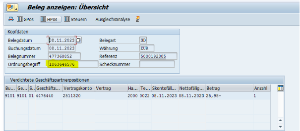

#docmorris #SAP 

# Screenshots SAP Docmorris

[Ordnungsbegriff FI-CA SAP Help](https://help.sap.com/doc/9275cb53f0f67314e10000000a174cb4/700_SFIN20%20006/de-DE/f305c5536a51204be10000000a174cb4.html)

# SAP help Infos

## Verwendung

Im FI-CA-Beleg und in Anordnungen können Sie das Attribut Ordnungsbegriff zur Identifizierung von Belegen verwenden. Der Ordnungsbegriff bietet eine ähnliche Funktionalität wie die Referenznummer, ermöglicht jedoch Schlüssel mit einer Länge von bis zu 35 Zeichen.

In der Geschäftspartnerposition können Sie das Feld Makler nutzen. Der Makler repräsentiert einen Geschäftspartner, der die Abwicklung bestimmter Prozesse, wie Zahlung oder Mahnung, gegenüber dem Endkunden übernimmt.

Ordnungsbegriff und Makler sind im System vorgesehene Erweiterungen. Das bedeutet, diese Attribute sind im ausgelieferten System zunächst nicht aktiv. Sie müssen sie explizit in Ihrer Installation aktivieren.

## Funktionsumfang

**Ordnungsbegriff**

Sie können den Ordnungsbegriff im Belegkopf eingeben und er steht bei der Beleganzeige, Belegänderung, dem Belegstorno und dem Massenstorno als Eingabefeld zur Verfügung.

Der Ordnungsbegriff wird in die Geschäftspartnerpositionen vererbt und kann im Kontenstand oder bei der Bearbeitung offener Posten angezeigt werden.

Im Kontenstand, bei der Selektion offener Posten (z.B. im Zahlungsstapel oder beim Buchen im Dialog), beim Ausbuchen, in Avisen zu eingehenden Zahlungen und beim Anlegen eines Ratenplans dient der Ordnungsbegriff als Selektionskriterium.

**Makler**

Das Feld dient als:

- Zusatzangabe, die bei der Belegerfassung, Belegänderung und Beleganzeige zur Verfügung steht
- Selektionskriterium für den Kontenstand
- Selektionskriterium für die Kontenpflege
- Selektionskriterium für sonstige Ausgleichsbearbeitungen
- Selektionskriterium im Zahlungsstapel
    
## Aktivitäten

Sie aktivieren die Felder Ordnungsbegriff und Makler im Einführungsleitfaden des Vertragskontokorrents unter Programmerweiterungen -> Vorbereitete Erweiterungen. Wenn Sie die entsprechenden Reports im Customizing ausführen, legen diese die benötigten Felder und Datenbankindizes an. Im Testmodus zeigen die Reports, welche Erweiterungen in einem Echtlauf vorgenommen werden würden.

> Hinweis: Ist der Ordnungsbegriff aktiv und wurden einige Belege mit Ordnungsbegriff gebucht, sollten Sie die Datenbankstatistik für die Tabelle DFKKKO aktualisieren. Ist der Makler aktiv sollten Sie die Datenbankstatistik für die Tabelle DFKKOP aktualisieren. Nur so können Sie sicherstellen, dass die neuen Indizes auch verwendet werden. Wenn Sie Anordnungen einsetzen, gilt dasselbe für die Tabelle DFKKORDERPOS.

Sie können Ordnungsbegriff und Makler wieder deaktivieren – jedoch nur manuell. Dazu müssen Sie im Falle des Ordnungsbegriffs das Feld OPORD und im Falle des Maklers das Feld BROKR aus den CI-Includes, in die es eingefügt wurde, wieder entfernen. Danach müssen Sie die Datenbanktabellen umsetzen. Dies kann eine erhebliche Laufzeit mit sich bringen, wenn bereits viele betroffene Datensätze existieren. Es empfiehlt sich daher, die Aktivierung des jeweiligen Feldes genau abzuwägen und dann an der getroffenen Entscheidung festzuhalten.